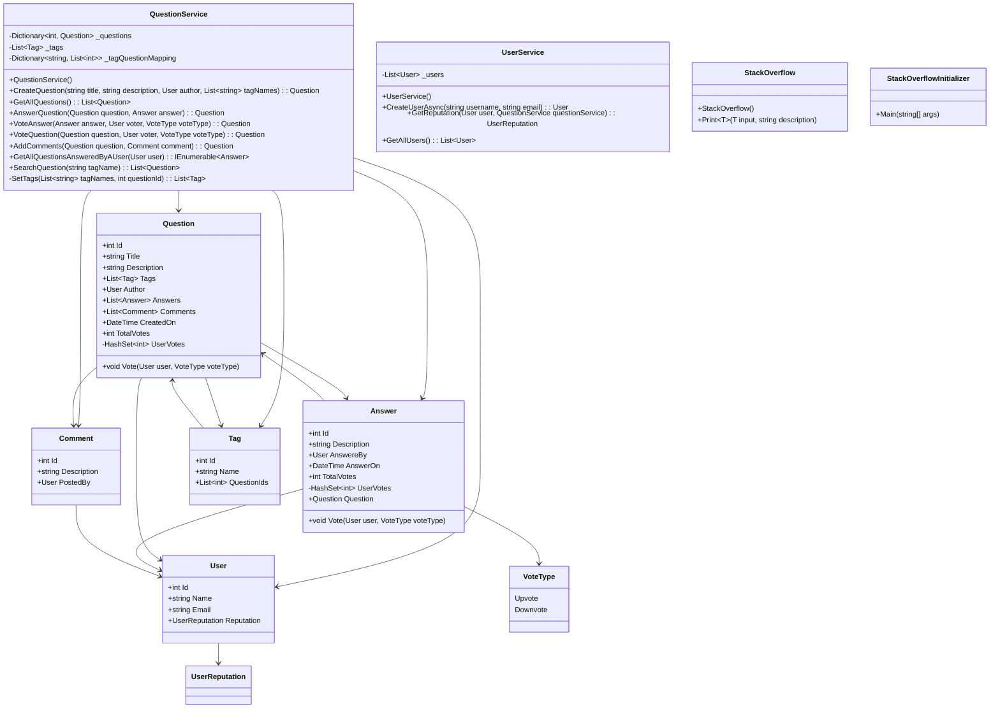

# Overview
Stack-overflow is a website for developers over which they can post their questions and other developers can answers those question.

# Functional Requirement
1. User should be able to post questions
2. User should be able to answer other posted questions
3. User can add comments to the questions
4. User should be able to search question by
    1. By Question Keywords
    2. By Tag
    3. By Username
5. User should be able to upvote the question
6. User reputation should be assigned based on number of upvotes they receive on questions

# Non Functional Requirement
1. System should be able to handle current users

